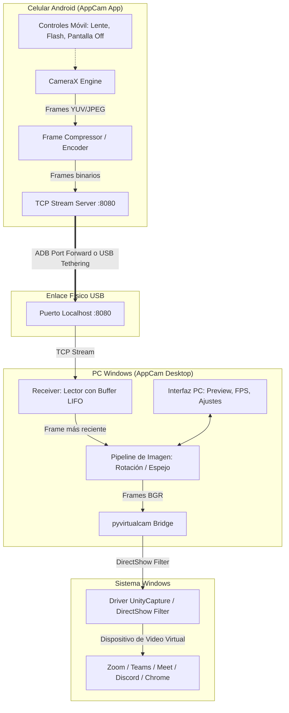

# Plan de desarrollo — AppCam: Cámara de Android como Webcam en Windows vía USB

## 1. Visión del producto

Construir una solución de software completa y de alto rendimiento que permita utilizar un teléfono móvil Android como webcam de alta definición en Windows 10/11 x64 a través de una conexión directa por cable USB.

El sistema debe operar de forma 100% local y autónoma: el video se transmite directamente del teléfono a la computadora por el cable USB (mediante ADB port forwarding o USB Tethering), sin consumir ancho de banda de internet, sin depender de redes Wi-Fi propensas a lag o interferencias, y sin telemetría externa.

En la computadora, la señal de video debe integrarse a nivel de sistema operativo como un dispositivo de entrada de video DirectShow independiente. Esto permite que cualquier aplicación de Windows (Google Meet, Microsoft Teams, Zoom, Discord, OBS Studio, Skype y navegadores web) reconozca el celular como si fuese una webcam USB física conectada al equipo.

La solución debe ofrecer:

- Conexión por cable USB de ultra baja latencia (< 80 ms).
- Transmisión en resoluciones HD (720p) y Full HD (1080p) a 30 o 60 FPS estables.
- Driver de cámara virtual DirectShow independiente y ligero (sin necesidad de instalar ni mantener abierto OBS Studio).
- Detección automática del teléfono enchufado por USB y reenvío de puertos sin configuración manual.
- Selección de cámara en el móvil (cámara trasera principal, ultra gran angular, frontal).
- Controles de captura: enfoque continuo, bloqueo de exposición, activación de linterna/flash y control de zoom.
- Modo de ahorro de batería y control térmico en el móvil (pantalla apagada o en negro mientras transmite video).
- Procesamiento en PC en tiempo real: rotación (0°, 90°, 180°, 270°), modo espejo horizontal/vertical, y pantalla de espera cuando el cable se desconecte para no congelar las videoconferencias.
- Instalación simple del driver mediante un script de un solo clic con permisos de sistema.

---

## 2. Decisiones técnicas

### Stack

- **Aplicación móvil (Android):** Kotlin + Jetpack CameraX.
- **Servidor de streaming móvil:** Socket TCP local embebido con compresión optimizada MJPEG y extensible a H.264 por MediaCodec.
- **Canal de transporte USB:**
  - *Modo principal:* ADB Port Forwarding (`adb forward tcp:PORT tcp:PORT`) utilizando un binario ligero de `platform-tools` integrado en el proyecto.
  - *Modo alternativo:* Red local cableada vía USB Tethering (RNDIS / Ethernet over USB).
- **Cliente y servidor receptor en PC:** Python 3.11 x64.
- **Procesamiento de video:** OpenCV (`opencv-python-headless` / `opencv-python`) + NumPy.
- **Puente a Cámara Virtual:** `pyvirtualcam` interactuando con el backend DirectShow independiente **UnityCapture**.
- **Driver DirectShow independiente:** Filtro DirectShow de 64 bits (`UnityCaptureFilter64.dll`), registrado en Windows vía `regsvr32.exe`.
- **Interfaz gráfica de escritorio (PC):** Python con interfaz reactiva y moderna (CustomTkinter / Tkinter).

### Por qué Android Nativo con CameraX

CameraX es la biblioteca oficial de Jetpack diseñada para garantizar consistencia en el comportamiento de las cámaras en todo el ecosistema Android (Samsung, Xiaomi, Motorola, Google Pixel, etc.):

- Proporciona acceso de bajo nivel a los streams de previsualización y análisis (`ImageAnalysis`) en formato YUV/JPEG con latencia cero en buffer.
- Permite alternar fácilmente entre lentes traseras (gran angular, normal) y delantera.
- Facilita el control de exposición, enfoque por toque y linterna.
- Consume drásticamente menos batería y memoria que frameworks multiplataforma pesados.

### Por qué Socket TCP sobre cable USB

A diferencia de una conexión Wi-Fi (que sufre variaciones de jitter, congestión de canal y caídas de paquetes), el bus USB 2.0/3.0 proporciona un ancho de banda sostenido de 480 Mbps a 5 Gbps con una latencia de transporte inferior a 2 milisegundos.

Utilizar un socket TCP con framing binario ligero garantiza:

1. Entrega en orden y sin pérdida de frames corruptos.
2. Latencia determinista: si un frame se retrasa, el receptor descarta frames obsoletos acumulados y siempre procesa el más reciente (política *Drop Oldest / Keep Latest*).
3. No requiere drivers propietarios ni configuraciones complejas de firewall.

### Por qué Driver DirectShow Independiente (UnityCapture) y no OBS Studio

Obligar al usuario a tener instalado y abierto OBS Studio solo para usar una webcam añade un consumo innecesario de 300-600 MB de RAM y uso constante de GPU en segundo plano.

El filtro DirectShow independiente (`UnityCapture`):
- Es una biblioteca DLL de menos de 1 MB.
- Se registra una única vez en el sistema con `regsvr32.exe`.
- No requiere ningún ejecutable ni servicio ejecutándose en segundo plano cuando no se usa la cámara.
- Es compatible de fábrica con `pyvirtualcam` (`backend='unitycapture'`).
- Es visible de inmediato para Zoom, Teams, Chrome, Discord y cualquier app nativa de Windows.

---

## 3. Arquitectura



### Límites entre capas

| Capa | Responsabilidad |
|---|---|
| **Android Capture (CameraX)** | Adquisición de frames desde el sensor, resolución, enfoque y orientación. |
| **Android Network Server** | Serialización binaria de frames y servicio socket TCP para el cliente USB. |
| **USB Helper (PC)** | Detección de dispositivos conectados (`adb devices`) y configuración de `adb forward`. |
| **PC Frame Receiver** | Lectura continua del socket, extracción de delimitadores y política de descarte de frames viejos. |
| **PC Image Processing** | Transformaciones de imagen (flip horizontal, rotación 90/180/270°, escalado si aplica). |
| **Virtual Camera Output** | Envío de frames BGR a la memoria compartida del driver DirectShow. |
| **Desktop UI** | Visualización en vivo, monitoreo de métricas (FPS, resolución, latencia) y controles. |
| **Windows Driver** | Exponer la interfaz DirectShow a las aplicaciones de videollamada del sistema operativo. |

---

## 4. Estructura propuesta del proyecto

```text
AppCam/
├── android/                             # Proyecto Android (Kotlin + Gradle)
│   ├── app/
│   │   ├── build.gradle.kts
│   │   ├── proguard-rules.pro
│   │   └── src/main/
│   │       ├── AndroidManifest.xml
│   │       ├── java/com/appcam/
│   │       │   ├── MainActivity.kt      # Actividad principal y UI de control
│   │       │   ├── camera/
│   │       │   │   ├── CameraService.kt # Gestión de CameraX y ciclo de vida
│   │       │   │   └── CameraConfig.kt  # Ajustes de resolución, FPS y lente
│   │       │   ├── network/
│   │       │   │   ├── StreamServer.kt  # Servidor TCP multi-hilo / corrutinas
│   │       │   │   └── PacketProtocol.kt# Protocolo de empaquetado de frames
│   │       │   └── util/
│   │       │       └── ImageUtils.kt    # Conversión YUV_420_888 a JPEG
│   │       └── res/
│   │           ├── layout/activity_main.xml
│   │           └── values/strings.xml
│   ├── build.gradle.kts
│   ├── settings.gradle.kts
│   └── gradlew.bat
│
├── pc_client/                           # Aplicación de escritorio para Windows
│   ├── requirements.txt                 # opencv-python, pyvirtualcam, numpy, pillow
│   ├── run.bat                          # Acceso directo para iniciar la app
│   ├── src/
│   │   ├── __init__.py
│   │   ├── main.py                      # Punto de entrada de la aplicación de PC
│   │   ├── core/
│   │   │   ├── connection.py            # Gestión del socket TCP y reconexión
│   │   │   ├── receiver.py              # Parser de protocolo y buffer LIFO
│   │   │   ├── processor.py             # Filtros, rotación, espejado y splash screen
│   │   │   └── virtual_camera.py        # Driver pyvirtualcam (UnityCapture backend)
│   │   ├── usb/
│   │   │   └── adb_manager.py           # Detección USB y ejecución de adb forward
│   │   ├── ui/
│   │   │   ├── app_window.py            # Ventana gráfica principal
│   │   │   ├── preview_canvas.py        # Canvas de preview en vivo
│   │   │   └── controls_panel.py        # Botones de inicio, rotación y resolución
│   │   └── utils/
│   │       ├── logger.py                # Logger de eventos local
│   │       └── assets.py                # Imagen de standby ("Conectando cámara...")
│   └── bin/                             # Binarios portables auxiliares
│       └── adb/                         # Binario adb.exe y librerías mínimas
│
├── driver/                              # Driver DirectShow independiente
│   ├── UnityCaptureFilter64.dll         # Filtro DirectShow 64 bits
│   ├── UnityCaptureFilter32.dll         # Filtro DirectShow 32 bits (compatibilidad)
│   ├── install_driver.bat               # Script de instalación con elevación UAC
│   └── uninstall_driver.bat             # Script de desinstalación limpia
│
├── scripts/                             # Scripts de automatización y pruebas
│   ├── test_virtualcam.py               # Prueba sintética de la cámara virtual
│   └── build_apk.bat                    # Compilación automatizada de la app Android
│
├── plan-desarrollo.md                   # Este documento
└── README.md                            # Guía de usuario y solución de problemas
```

---

## 5. Protocolo y comunicación USB

### Transporte sobre USB

Se implementan dos vías de comunicación sobre cable USB:

1. **Modo ADB (Recomendado):**
   - El teléfono tiene activada la "Depuración por USB".
   - Al conectar el cable, `adb_manager.py` en la PC detecta el dispositivo (`adb devices`).
   - Ejecuta automáticamente: `adb forward tcp:8080 tcp:8080`.
   - La PC se conecta a `127.0.0.1:8080`. El túnel USB redirige todos los paquetes al socket de la app en el teléfono sin salir a la red.
2. **Modo USB Tethering (Anclaje USB):**
   - El usuario activa "Compartir internet / anclaje por USB" en los ajustes de Android.
   - Windows reconoce una interfaz de red NDIS.
   - La PC se conecta a la IP de la puerta de enlace (`192.168.42.129:8080`).

### Estructura de paquetes de video

Cada frame de video se envía precedido por una cabecera binaria fija de 16 bytes:

| Offset (bytes) | Campo | Tipo | Descripción |
|---|---|---|---|
| 0 - 3 | `MAGIC` | `ASCII [4]` | `0x41, 0x50, 0x43, 0x4D` ("APCM") |
| 4 - 7 | `FRAME_ID` | `uint32` | Número secuencial del frame |
| 8 - 11 | `TIMESTAMP`| `uint32` | Timestamp en milisegundos para cálculo de latencia |
| 12 - 15 | `LENGTH` | `uint32` | Longitud en bytes de la imagen comprimida (JPEG) |
| 16 - N | `PAYLOAD` | `byte[]` | Bytes binarios de la imagen JPEG codificada |

### Política de buffer LIFO (Low Latency)

En video en tiempo real para videollamadas, un frame de hace 200 ms no sirve.
El receptor en PC mantiene un buffer de exactamente **1 frame**:
- Un hilo de red lee continuamente los datos del socket.
- Si llega un frame nuevo mientras el procesador de video está enviando el anterior a la cámara virtual, el anterior se descarta inmediatamente.
- De esta manera, el retraso observado en pantalla es exclusivamente el tiempo de compresión y transporte instantáneo (< 50 ms).

---

## 6. Cámara Virtual en Windows (Driver Independiente)

### Cómo funciona el backend UnityCapture

1. **Filtro DirectShow:** `UnityCaptureFilter64.dll` es un filtro COM DirectShow que se registra en el Registro de Windows bajo la categoría `CLSID_VideoInputDeviceCategory`.
2. **Memoria compartida:** El driver crea un bloque de memoria compartida en Windows (Memory-Mapped File).
3. **Inyección con `pyvirtualcam`:**
   ```python
   import pyvirtualcam
   with pyvirtualcam.Camera(width=1920, height=1080, fps=30, backend='unitycapture', fmt=pyvirtualcam.PixelFormat.BGR) as cam:
       while True:
           cam.send(frame)
           cam.sleep_until_next_frame()
   ```
4. **Visibilidad universal:** Las aplicaciones cliente (Zoom, Teams, Meet) solicitan los dispositivos de captura de video a Windows Media Foundation / DirectShow y encuentran inmediatamente "Unity Video Capture" (o el nombre registrado para AppCam) como si fuese hardware físico.

### Instalación y Desinstalación automatizada

- `install_driver.bat`:
  ```bat
  @echo off
  :: Solicitar elevación de privilegios UAC si no es administrador
  net session >nul 2>&1
  if %errorlevel% neq 0 (
      powershell -Command "Start-Process '%~f0' -Verb RunAs"
      exit /b
  )
  regsvr32.exe /s "%~dp0UnityCaptureFilter64.dll"
  echo Driver de camara virtual registrado correctamente.
  pause
  ```
- `uninstall_driver.bat`:
  Ejecuta `regsvr32.exe /u /s UnityCaptureFilter64.dll` para dejar el sistema completamente limpio si el usuario desea desinstalarlo.

---

## 7. Estados y recuperación

### Máquina de estados de la conexión

```text
[ DESCONECTADO ]
       │
       ▼ (Cable USB conectado y detectado)
[ SINCRONIZANDO PUERTO ADB ]
       │
       ▼ (Socket TCP abierto)
[ CONECTADO / ESPERANDO STREAM ]
       │
       ▼ (Primer frame APCM válido recibido)
[ TRANSMITIENDO EN VIVO ] ──(Rotación / Espejo / Ajustes)
       │
       ├─► (Desconexión de cable o cierre de app móvil)
       │         │
       │         ▼
       │   [ MODO STANDBY ] ──(Envía imagen 'AppCam Desconectado' a la virtual cam)
       │         │
       │         ▼ (Reintento automático cada 2 segundos)
       └─────────┴──► [ DESCONECTADO ]
```

### Manejo de desconexión sin congelamiento de apps

Si el usuario desconecta accidentalmente el cable USB durante una reunión importante de Zoom o Google Meet:
- La app en PC **no destruye** la cámara virtual (destruir el dispositivo causaría un error fatal en la videollamada o cambiaría a la cámara integrada de baja calidad).
- La app en PC inyecta continuamente un frame elegante de espera ("AppCam — Dispositivo desconectado, reconectando...").
- En cuanto el cable se vuelve a conectar, la transmisión se reanuda de inmediato sin necesidad de reiniciar la llamada.

---

## 8. Funcionalidades en Android y PC

### Aplicación Móvil (Android)
- **Selector de cámara:** Conmutar entre sensor trasero principal, lente ultra-angular (si el hardware lo expone) y cámara frontal.
- **Selector de resolución:**
  - 1920x1080 (1080p Full HD) - Máxima nitidez para presentaciones.
  - 1280x720 (720p HD) - Óptimo para videollamadas estándar y menor consumo térmico.
- **Control de iluminación:** Interruptor para encender el flash/linterna trasera como foco de luz continuo.
- **Control de enfoque:** Enfoque automático continuo o bloqueo de enfoque con un toque en la pantalla.
- **Modo "Pantalla Oscura / Ahorro":** Botón para oscurecer la pantalla por completo (brillo mínimo o canvas negro con reloj tenue) mientras se transmite, evitando calentamiento del panel AMOLED y ahorrando batería.

### Aplicación de Escritorio (PC)
- **Vista previa en tiempo real:** Canvas interactivo con el video en vivo.
- **Transformaciones de imagen:**
  - Espejo horizontal (Flip horizontal) para verse de forma natural.
  - Rotaciones de 90°, 180° y 270° (permite usar el móvil tanto en horizontal como en vertical).
- **Indicadores de estado:**
  - FPS reales recibidos vs emitidos.
  - Tasa de bits (Kbps / Mbps).
  - Estado del enlace USB (Conectado / Desconectado).
- **Selector de dispositivo virtual:** Botón para activar/desactivar la emisión a la cámara virtual de Windows.

---

## 9. Privacidad y seguridad

- **Tráfico 100% cableado y local:** Los datos no tocan ningún router ni servidor web; viajan exclusivamente por el bus de cobre del cable USB.
- **Sin cuentas ni registros:** No requiere login, cuentas de correo ni permisos de internet en la PC.
- **Sin telemetría:** La aplicación no recopila datos de uso, diagnósticos remotos ni estadísticas.
- **Permisos mínimos en Android:** Únicamente permiso de `CAMERA` (captura de video) y servicio en primer plano para evitar que el sistema mate la app. No se requieren permisos de contactos, almacenamiento ni ubicación.

---

## 10. Fases de implementación

### Fase 0 — Spike de Cámara Virtual y Driver Independiente
- Descargar y estructurar los binarios de `UnityCaptureFilter64.dll`.
- Crear los scripts de registro y desregistro (`install_driver.bat` y `uninstall_driver.bat`).
- Configurar el entorno virtual de Python 3.11 con `pyvirtualcam` y `opencv-python`.
- Crear un script de prueba sintética (`test_virtualcam.py`) que genere un patrón de prueba (círculo en movimiento y contador de FPS) y lo envíe al driver virtual.
- Verificar que la app nativa "Cámara" de Windows y el navegador reconozcan el dispositivo "Unity Video Capture".

> **Criterio de salida:** La app "Cámara" de Windows muestra el video sintético generado en Python a 30 FPS sin tener OBS Studio instalado.

---

### Fase 1 — Módulo de Enlace USB y Detección ADB
- Integrar binario portable de `adb.exe` en `pc_client/bin/adb/` (sin requerir instalación en el sistema).
- Implementar `adb_manager.py` para consultar dispositivos (`adb devices`) y automatizar la regla de reenvío `adb forward tcp:8080 tcp:8080`.
- Desarrollar detección de desconexión y reconexión de eventos USB.
- Crear fallback para detección de IP en modo USB Tethering.

> **Criterio de salida:** Al conectar el celular Android con depuración USB, el script de PC detecta el dispositivo y establece el túnel de puertos automáticamente.

---

### Fase 2 — Receptor de Video en PC con Buffer de Latencia Cero
- Desarrollar el protocolo binario de paquetes (`PacketProtocol`) en Python (`receiver.py`).
- Implementar lectura asíncrona de socket TCP en hilo dedicado.
- Diseñar la política de descarte de frames obsoletos (Buffer LIFO) para garantizar que la imagen en pantalla nunca acumule retraso.
- Implementar generador de pantalla de standby ("Buscando señal USB...") para cuando no haya stream activo.

> **Criterio de salida:** El receptor puede conectarse a un socket simulado, procesar 60 FPS sin fugas de memoria y mantener la latencia en menos de 1 frame.

---

### Fase 3 — App Móvil Android (CameraX + Servidor de Streaming)
- Estructurar el proyecto Android en `android/` con Gradle y Kotlin.
- Implementar `CameraService.kt` utilizando Jetpack CameraX:
  - Configurar caso de uso `ImageAnalysis`.
  - Conversión eficiente de buffer YUV a JPEG comprimido.
- Implementar `StreamServer.kt`:
  - Servidor TCP en puerto 8080 escuchando en `localhost`.
  - Serialización de paquetes con la cabecera `APCM` de 16 bytes.
- Crear UI básica en Android con botones para iniciar/detener transmisión y selector de resolución (720p/1080p).

> **Criterio de salida:** La app de Android corre en el teléfono, captura frames de la cámara y los transmite por el puerto local a través del cable USB.

---

### Fase 4 — Integración E2E (Móvil → USB → Cámara Virtual)
- Conectar la salida del stream de Android al receptor de PC y de allí a la cámara virtual `pyvirtualcam`.
- Medir latencia total end-to-end con un cronómetro en pantalla.
- Implementar transformaciones en caliente:
  - Rotación 90°, 180°, 270°.
  - Espejo horizontal (Flip horizontal).
- Validar estabilidad durante 30 minutos continuos de transmisión.

> **Criterio de salida:** Abrir Google Meet o Zoom en Windows, seleccionar la cámara virtual y ver el video del celular en tiempo real con latencia imperceptible.

---

### Fase 5 — Interfaz de Usuario Avanzada y Control Térmico
- **En la PC:**
  - Construir la interfaz gráfica de escritorio (`app_window.py`) con vista previa, controles de rotación, selector de resolución, selector de calidad de compresión e indicadores de FPS/Bitrate.
- **En Android:**
  - Incorporar selector de lentes (trasera / frontal / gran angular).
  - Añadir control de linterna (flash continuo).
  - Implementar modo de pantalla apagada / oscura para evitar calentamiento de la pantalla durante llamadas largas.
  - Implementar bloqueo de pantalla (WakeLock) para evitar que el teléfono suspenda la CPU mientras transmite.

> **Criterio de salida:** Ambas interfaces cuentan con controles completos y la app móvil puede transmitir durante una hora sin sobrecalentar el dispositivo.

---

### Fase 6 — Empaquetado, Scripts de Ejecución y Documentación
- Crear script `run.bat` en la raíz de `pc_client/` que verifique el entorno virtual de Python, instale dependencias si faltan y arranque la aplicación en un solo clic.
- Generar script para compilar el APK de Android (`build_apk.bat`) y proporcionar instrucciones claras para instalarlo en el móvil mediante ADB (`adb install app-debug.apk`).
- Documentar en el `README.md` el proceso de activación de "Depuración por USB" en Android y la configuración paso a paso.

> **Criterio de salida:** Un usuario puede clonar el repositorio, ejecutar el instalador del driver, instalar el APK y tener la webcam funcionando en menos de 5 minutos.

---

## 11. Qué no construir todavía

Para asegurar un desarrollo rápido, robusto y centrado en la máxima calidad:

- **Audio bridging complejo:** No transmitiremos audio del micrófono del móvil en el MVP (Windows ya cuenta con soporte nativo de micrófonos, y mezclar audio y video por sockets sin sincronización RTP/AV puede introducir desincronización labial).
- **Conexión Wi-Fi inalámbrica:** No se priorizará Wi-Fi en las primeras versiones, ya que genera latencia impredecible, pérdida de paquetes y caídas de bitrate.
- **Servidores en la nube o WebRTC remoto:** No se utilizará infraestructura externa de señalización ni servidores STUN/TURN.
- **Soporte para iOS:** Esta versión estará estrictamente enfocada en Android.

---

## 12. Riesgos y mitigaciones

| Riesgo | Probabilidad | Impacto | Mitigación técnica |
|---|---|---|---|
| **Sobrecalentamiento del celular** | Media | Alto | Limitar resolución por defecto a 720p/1080p 30 FPS; implementar modo "pantalla apagada" que apaga los píxeles de la pantalla durante la llamada. |
| **Acumulación de latencia en buffer** | Media | Alto | Estrategia *Drop Oldest*: el buffer de recepción de la PC siempre descarta frames no procesados para mostrar únicamente el frame más fresco. |
| **Permisos de administrador para el driver** | Alta | Bajo | Script `install_driver.bat` con elevación automática por UAC mediante PowerShell, registrando el DLL en 2 segundos. |
| **Desconexión accidental del cable USB** | Alta | Medio | La PC mantiene viva la cámara virtual emitiendo un frame gráfico de "Reconectando...", evitando que Zoom o Teams arrojen error de hardware. |
| **Diferencias de orientación según el teléfono** | Alta | Bajo | Procesamiento con `cv2.rotate` en la PC para permitir corregir la orientación con un botón (0°, 90°, 180°, 270°). |

---

## 13. Definición del MVP

El MVP (Producto Mínimo Viable) estará completo cuando:

1. El driver DirectShow independiente quede registrado en Windows mediante `install_driver.bat` sin requerir OBS Studio.
2. El script de PC detecte el celular Android conectado por USB y configure el reenvío de puertos.
3. La aplicación Android capture video con CameraX y lo transmita por socket TCP por el cable USB.
4. El cliente en PC reciba el video, lo procese a 30 FPS mínimos con latencia < 80 ms y lo entregue a la cámara virtual.
5. Aplicaciones como Google Meet, Zoom o la app "Cámara" de Windows muestren la imagen del celular con nitidez y fluidez.
6. La app en PC ofrezca control de orientación (rotación y espejo) y reconexión automática si se desconecta el cable.

---

## 14. Primera decisión de implementación

Comenzaremos de inmediato por la **Fase 0**:
1. Descargar y ubicar la DLL del driver DirectShow independiente (`UnityCaptureFilter64.dll`) en la carpeta `driver/`.
2. Crear los scripts `install_driver.bat` y `uninstall_driver.bat`.
3. Configurar el entorno virtual de Python en `pc_client/` con `pyvirtualcam` y dependencias.
4. Ejecutar el script de prueba sintética para verificar que Windows y aplicaciones como Zoom/Cámara reconozcan la cámara virtual.
